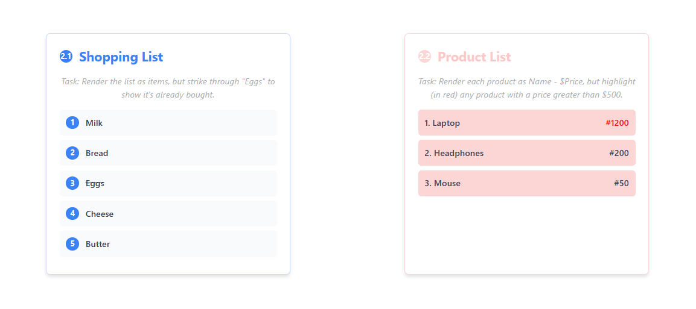
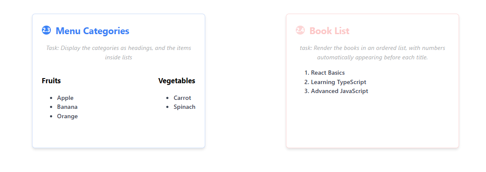
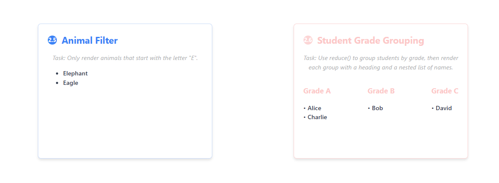
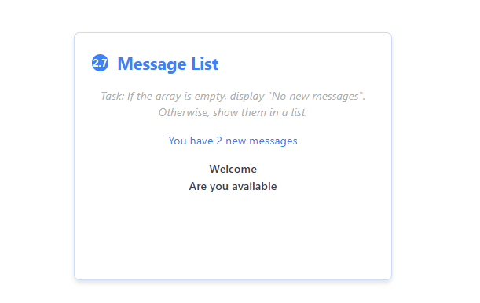

# React List Rendering Exercises

A collection of React components demonstrating various list rendering techniques, conditional styling, and data manipulation patterns.

## 🚀 Technologies Used

-   React 18
-   TypeScript
-   CSS3

## 📋 Exercises Overview

### 2.1 ShoppingList.tsx

Basic list rendering with conditional styling - strikes through purchased items.

### 2.2 ProductList.tsx

Product display with price-based conditional styling - highlights expensive items in red.

### 2.3 MenuCategories.tsx

Nested list structure displaying categorized menu items with proper hierarchy.

### 2.4 BookList.tsx

Ordered list implementation with automatic numbering for book titles.

### 2.5 AnimalFilter.tsx

Array filtering demonstration - displays only animals starting with "E".

### 2.6 StudentGroups.tsx

Advanced grouping using `reduce()` to organize students by grade levels.

### 2.7 MessageList.tsx

Conditional rendering pattern - shows placeholder when no messages exist.

## 🖼️ Screenshots


_Shopping list with strikethrough styling for purchased items and Product listing with price-based highlighting_

  
_Nested category structure with fruits and vegetables_


_Rendering Animals that starts with letter from an array and grouping of students' grade_


_Conditionally renders messages if they exist_

## 🛠️ Installation & Setup

```bash
# Clone the repository
git clone <repository-url>

# Navigate to project directory
cd working-with-react

# Install dependencies
npm install

# Start development server
npm run dev
```

## 🎯 Key Learning Concepts

-   Array `.map()` method for rendering lists
-   Conditional styling with inline styles and CSS classes
-   Nested list structures and component composition
-   Array filtering and data manipulation
-   Using `.reduce()` for data grouping
-   Conditional rendering patterns
-   TypeScript integration with React components

## 📝 Usage

Each component is self-contained and can be used independently. The main `App.jsx` displays all exercises in a clean, organized layout with proper headings and spacing.

## 📄 License

This project is open source and available under the [MIT License](LICENSE).
